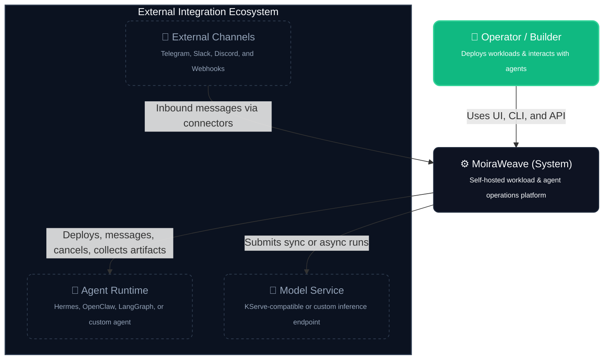
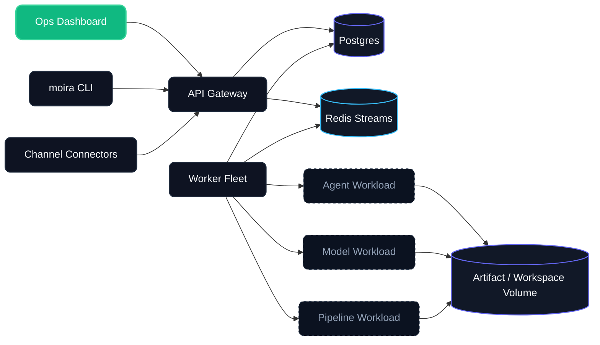
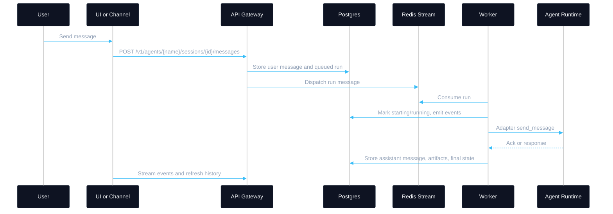
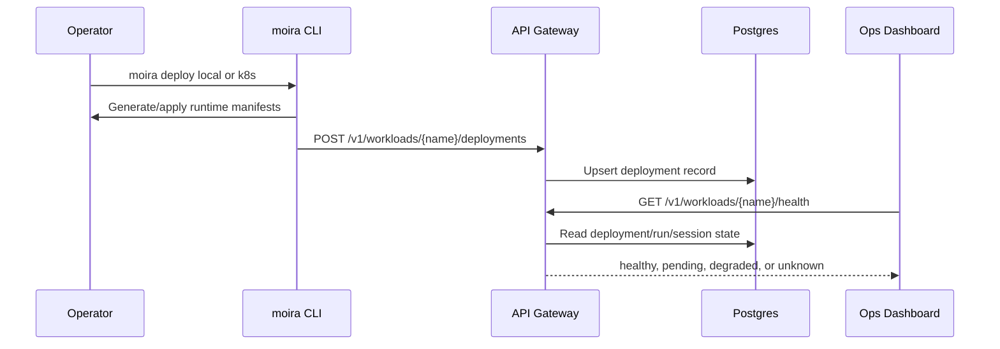
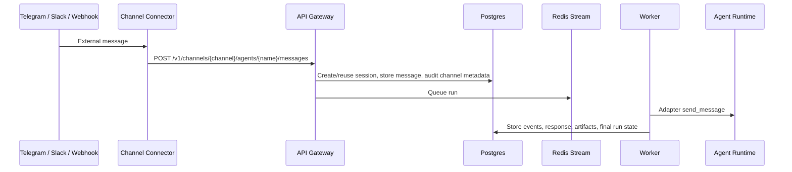

# Agent Operations Architecture

MoiraWeave is the control plane around AI workloads. It deploys and operates
models, pipelines, and agents, but it does not replace the internals of Hermes,
OpenClaw, LangGraph, or a custom runtime.

## C4 Context

## Containers

## Agent Message Sequence

## Deployment And Health Sequence

## Channel Inbound Sequence

## Operational Boundary

MoiraWeave owns:

- workload deployment metadata
- deployment health derived from control-plane state
- sessions, messages, runs, events, artifacts, and health
- channel audit records for UI/API/Telegram/Slack/Discord/Webhook ingress
- cancellation and stale-run detection
- UI/API/CLI/channel surfaces
- environment-specific deployment assets

Agent runtimes own:

- reasoning loop and planning
- tool execution implementation
- memory internals
- runtime-specific configuration
- provider-specific model calls

## Adapter Contract

Every agent adapter exposes the same operational shape:

- `send_message(payload)`: short-lived dispatch call
- `wait_for_completion(payload, accepted)`: follow runtime status/events until terminal state or timeout
- `get_status(payload)`: check runtime or session health
- `cancel(payload)`: cooperative cancellation hook
- `list_artifacts(payload)`: discover runtime-produced artifacts

Long-running agents should acknowledge a message quickly and continue work in
their own process. MoiraWeave follows progress through stored events, health
checks, and adapter status calls instead of holding a request open for hours.

Runtime-specific details live in
[Agent Runtime Integrations](agent-runtime-integrations.md).

## Current API Surface

- `POST /v1/workloads/{name}/deployments`: record local or Kubernetes deployment state.
- `GET /v1/deployments`: list deployment records visible to the authenticated user.
- `GET /v1/workloads/{name}/health`: summarize health from deployment state and probe deployment endpoints when present.
- `POST /v1/channels/{channel}/agents/{name}/messages`: authenticated inbound channel bridge.
- `GET /v1/agents/{name}/sessions/{session_id}/health`: summarize a session and its latest run.
